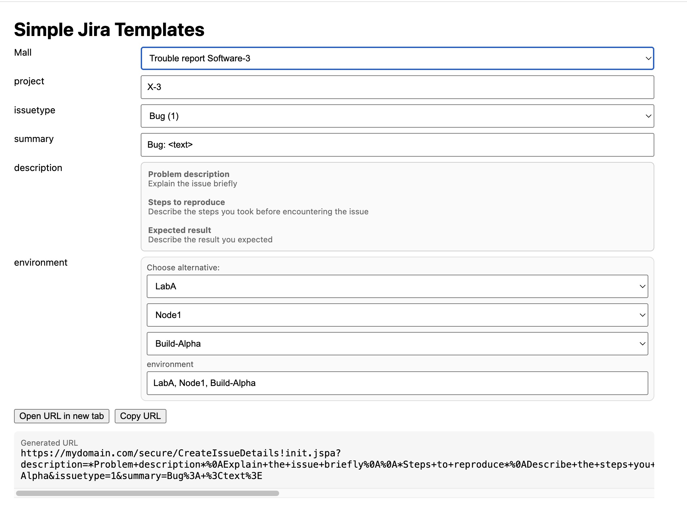

# (Simple) Jira Templates
[](https://developer.mozilla.org/en-US/docs/Web/HTML)
[](#)
[](#)

---

## Background
By pure coincidence, I discovered that Jira can pre-fill issue fields simply by adding parameters to a **URL**.  
When I clicked one of those URLs, a new issue opened — already filled in!  
It turned out this wasn’t an official API, but rather an **internal Jira feature** used by the platform itself.

That led to a thought: *what if there was a simple webpage that built these URLs automatically — with reusable templates for common reports?*  
This project is the result, and it might be helpful if, for some reason, Jira’s built-in templates are not accessible. Some

> You must be logged in to Jira for this to work. Use at your own risk.



---

## Editing templates

All templates and configuration live **at the top of the HTML file**, inside a YAML block:

```yaml
<script type="text/yaml" id="templatesYaml">
templates:
  "Bug report CCX-3":
    project: "CCX-3"
    issuetype: "Bug"
    summary: "Bug: <text>"
    description: |
      *Problem description*
      <text>

      *Reproduction*
      <text>

defaults:
  baseUrl: "https://mydomain.com"
  endpoint: "init"
  pid:
    "CCX-3": 10302
  order: ["issuetype","summary"]
  issuetypes:
    Bug: 1
    Epic: 2
  dynamic_fields:
    environment:
      lab:   ["LabA","LabB","LabC"]
      node:  ["Node1","Node2","Node3"]
      build: ["Build-Alpha","Build-Beta","Build-Gamma"]
</script>
```

You edit the YAML **directly inside the file**.  
Reason: a Single Page Application (SPA) cannot load local files due to browser sandbox (CORS) restrictions.  
By embedding YAML inline, the tool remains fully self-contained — no dependencies, no external calls.

---

## Fields

| Section | Description |
|----------|-------------|
| **templates** | Each template appears in the *Template* dropdown. |
| **defaults** | Defines global settings: base URL, endpoint, PID mapping, field order, and dropdown maps. |
| **maps** | Optional mapping tables for converting readable names (like `"Bug"`) to numeric IDs. |
| **dynamic_fields** | Builds dropdown groups that combine into a single field value (e.g. `environment`). |

All field labels in the UI match their YAML field names (`project`, `description`, `environment`, etc.).

---

## Text formatting
Only **bold** text (`*text*`) is rendered.  
Line breaks are preserved exactly as written in YAML.

---

## Usage

1. Save the file as `jira-template.html`.  
2. Run it directly in your browser by just opening it, or run it locally:
   ```bash
   python3 -m http.server 8080
   # open http://localhost:8080/jira-template.html
   ```
3. Choose a template, adjust fields, click **Open in Jira** or **Copy URL**.

---

## New & Improved Features

-  **String ↔ number mapping** for any field via `defaults.maps.<field>`.
-  **Automatic dropdowns** if a map contains ≥2 values; otherwise text fields with live ID hints.
-  **Dynamic fields** (e.g. `environment`) composed from multiple dropdowns.
-  **Project-to-PID mapping** via `defaults.pid`.
-  **Configurable field order** with `defaults.order`.
-  **Cloud or Server endpoint** (`endpoint: "init"` → Cloud, `"default"` → Server).
-  **Graceful fallback** — missing or extra fields never crash.

---

## Security

- 100% local — no network calls or dependencies.  
- `noopener,noreferrer` prevents referer leaks.  
- Minimal, safe YAML parser (no evals or script execution).  
- Warns if URL exceeds ~1800 characters.

## Limitations

 - Some fields such a labels, need to be sent as numeric values
   Start dev tools in Chrome and start the "Create new" Issue in Jira. Now you can often see the code of attributes that can be used in the script in the response of the network tab. 
   Once you have the value it can be used in the mapping section in YAML. This is very brittle. Use at own risk.
---

## Example of a dynamic field

```yaml
dynamic_fields:
  environment:
    lab:   ["LabA","LabB","LabC"]
    node:  ["Node1","Node2","Node3"]
    build: ["Build-Alpha","Build-Beta","Build-Gamma"]
```

This generates three dropdowns — **Lab**, **Node**, and **Build** — which together form the `environment` field in Jira.  
You can still edit the combined result manually.

---

## Repository setup

The project is fully local — no build tools or dependencies needed.

```bash
git clone https://github.com/stromg/jira-template.git
cd jira-template
python3 -m http.server 8080
```

---

## Reference links

- [How to create issues using direct HTML links in Jira Server (Atlassian KB)](https://confluence.atlassian.com/jirakb/how-to-create-issues-using-direct-html-links-in-jira-159474.html)
- [Pre-populate Label in CreateIssue URL (Atlassian Community)](https://community.atlassian.com/t5/Jira-questions/Pre-populate-Label-in-CreateIssue-URL/qaq-p/628361)

---

Vibe-coded with ❤️ by **Göran Ström**
